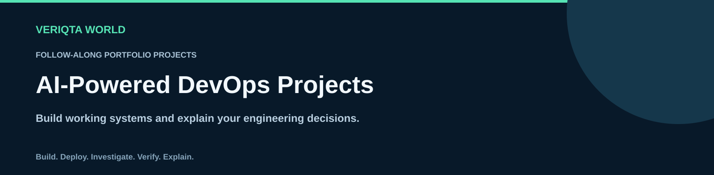
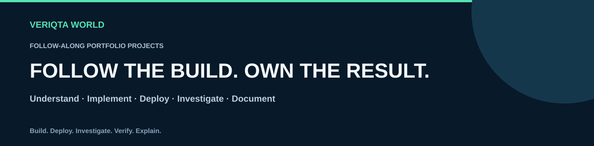
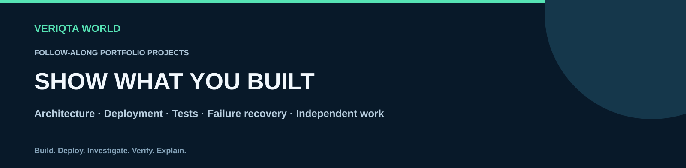

# AI-Powered DevOps Projects

**Follow-along portfolio projects for building, deploying and operating working systems with integrated AI capabilities.**

[Choose a project](#project-catalogue) · [How to follow the projects](#how-to-follow-the-projects) · [Portfolio evidence](#build-your-portfolio-evidence)

Explore practical projects across cloud delivery, Kubernetes, infrastructure, observability, reliability, platform engineering, security and recovery. Each project guides you through a complete engineering workflow and finishes with an independent extension and a demonstrable outcome.

## How to follow the projects

Choose a project aligned with the skills you want to develop. Follow its numbered walkthrough from understanding the system and setting up the environment to implementation, deployment, failure investigation, portfolio documentation and cleanup.

Each project includes thirteen walkthrough steps. Application-building and AI-integration steps use filenames matched to the specific project. Supporting folders organise application code, infrastructure, tests and visuals.

Use the environment prerequisites in the setup step. Review cloud pricing and resource requirements before provisioning. Practise failures in an isolated environment and clean up resources after completing the work.

## Project catalogue

| No. | Project | Final demonstration |
| --- | --- | --- |
| 1 | [Cloud Application with AI Operations](projects/01-cloud-application-with-ai-operations) | Deploy an application, investigate a controlled failure and verify recovery. |
| 2 | [CI/CD Pipeline with AI Failure Analysis](projects/02-ci-cd-pipeline-with-ai-failure-analysis) | Evaluate diagnostic reports against a labelled set of failed builds. |
| 3 | [Secure Container Delivery Pipeline](projects/03-secure-container-delivery-pipeline) | Block a vulnerable image, correct it and verify the released artifact. |
| 4 | [Pull Request Preview Environments](projects/04-pull-request-preview-environments) | Create a preview environment, investigate a failed deployment and demonstrate automatic cleanup. |
| 5 | [Canary Deployment with AI Release Analysis](projects/05-canary-deployment-with-ai-release-analysis) | Promote a healthy release and roll back a deliberately faulty release. |
| 6 | [Kubernetes Troubleshooting App](projects/06-kubernetes-troubleshooting-app) | Investigate injected workload, scheduling, DNS and storage failures. |
| 7 | [Infrastructure Provisioning Portal](projects/07-infrastructure-provisioning-portal) | Provision an approved environment and show a prohibited request being rejected. |
| 8 | [Terraform Change Review App](projects/08-terraform-change-review-app) | Block a destructive change and approve a validated safe change. |
| 9 | [Infrastructure Drift Detection Dashboard](projects/09-infrastructure-drift-detection-dashboard) | Introduce unmanaged configuration, detect the difference and verify reconciliation. |
| 10 | [GitOps Application Delivery](projects/10-gitops-application-delivery) | Deploy a change, introduce drift and recover from a broken release. |
| 11 | [Distributed App Observability](projects/11-distributed-app-observability) | Trace an injected dependency or latency failure across service boundaries. |
| 12 | [SLO and Error Budget Dashboard](projects/12-slo-and-error-budget-dashboard) | Generate a controlled SLO breach and explain the verified evidence. |
| 13 | [Incident Response Workspace](projects/13-incident-response-workspace) | Demonstrate incident creation, investigation, recovery and a reviewed postmortem. |
| 14 | [Runbook Search and Answer App](projects/14-runbook-search-and-answer-app) | Test correct answers, missing information, conflicting sources and restricted access. |
| 15 | [Resilience Testing Lab](projects/15-resilience-testing-lab) | Measure recovery behaviour before and after a resilience improvement. |
| 16 | [Internal Developer Portal](projects/16-internal-developer-portal) | Onboard an application and demonstrate ownership, deployment and discoverable documentation. |
| 17 | [Developer Environment Portal](projects/17-developer-environment-portal) | Create an environment, enforce a quota and verify expiration and cleanup. |
| 18 | [Developer Support App](projects/18-developer-support-app) | Route a known issue correctly and escalate an unsupported diagnosis. |
| 19 | [Service Dependency Dashboard](projects/19-service-dependency-dashboard) | Introduce a dependency failure and compare observed impact with the prediction. |
| 20 | [AI Model Serving on Kubernetes](projects/20-ai-model-serving-on-kubernetes) | Load-test inference, introduce a bad model version and demonstrate rollback. |
| 21 | [Cloud Cost Monitoring Dashboard](projects/21-cloud-cost-monitoring-dashboard) | Investigate a controlled cost increase and verify a proposed optimisation. |
| 22 | [Vulnerability Remediation Dashboard](projects/22-vulnerability-remediation-dashboard) | Track a finding from detection through review, correction and verified rescanning. |
| 23 | [Secure AI Operations Gateway](projects/23-secure-ai-operations-gateway) | Block prohibited operations and demonstrate a reviewed, authorised action. |
| 24 | [Backup and Restore Verification](projects/24-backup-and-restore-verification) | Restore application data, verify integrity and measure recovery time and data loss. |
| 25 | [AI Assistant Evaluation Pipeline](projects/25-ai-assistant-evaluation-pipeline) | Compare assistant versions and block a release that fails the evaluation criteria. |

## Build your portfolio evidence

- Show a working application or service with reproducible setup and deployment.
- Explain the architecture, technology choices and meaningful trade-offs.
- Record test results, monitoring evidence and a controlled failure investigation.
- Explain what AI contributes, how you evaluated it and its limitations.
- Demonstrate recovery, resource cleanup and the appropriate access controls.
- Complete an independent extension and distinguish your work from the guided implementation.
- Prepare a short demonstration and describe measured outcomes accurately on your résumé.

Select a few projects relevant to your target role and complete them thoroughly. These are educational portfolio builds; completing them does not establish professional production experience or guarantee employment.

## Project completion

A project is complete when you can reproduce the build, demonstrate its intended behaviour, investigate a failure, verify recovery and explain the implementation without relying on the walkthrough. Keep evidence of your independent decisions and improvements.

[Review the portfolio checklist](PORTFOLIO-CHECKLIST.md)

## Contribute

Improve explanations, report errors and contribute tested implementation guidance. Include the environment, relevant versions, expected behaviour and verification evidence.

[Read the contribution guide](CONTRIBUTING.md)

## About VERIQTA WORLD

VERIQTA WORLD shares engineering resources that connect learning with practical work.

[Explore VERIQTA WORLD](https://github.com/VERIQTA-WORLD)

Product names and trademarks belong to their respective owners. This independent educational collection does not imply affiliation or endorsement.
