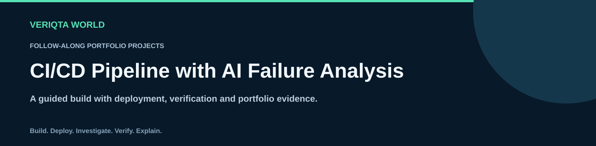
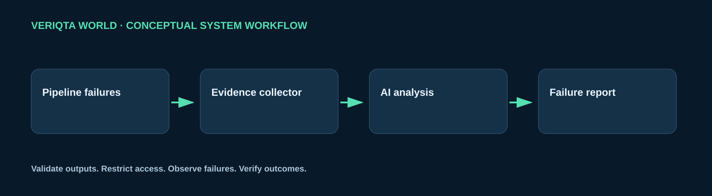

# Build a CI/CD Pipeline with AI Failure Analysis

Build a pipeline failure investigation service that collects build evidence and produces reviewed diagnostic reports.

## What you will build

Create a working system with application components, an AI capability, automated delivery and operational visibility. Review access boundaries, test expected behaviour and investigate controlled failures.

## Architecture

This diagram shows the conceptual workflow. The implementation steps cover the application, infrastructure, delivery pipeline and operational controls.

## Follow the walkthrough

| Step | Build activity |
| --- | --- |
| 1 | [Understand the project](01-understand-the-project.md) |
| 2 | [Set up your environment](02-set-up-your-environment.md) |
| 3 | [Build the pipeline event service](03-build-the-pipeline-event-service.md) |
| 4 | [Add build failure analysis](04-add-build-failure-analysis.md) |
| 5 | [Containerize the application](05-containerize-the-application.md) |
| 6 | [Create the infrastructure](06-create-the-infrastructure.md) |
| 7 | [Build the CI/CD pipeline](07-build-the-cicd-pipeline.md) |
| 8 | [Deploy and test the system](08-deploy-and-test-the-system.md) |
| 9 | [Add monitoring and security](09-add-monitoring-and-security.md) |
| 10 | [Break, fix and recover](10-break-fix-and-recover.md) |
| 11 | [Complete your own extension](11-complete-your-own-extension.md) |
| 12 | [Document your portfolio](12-document-your-portfolio.md) |
| 13 | [Clean up your resources](13-clean-up-your-resources.md) |

## Your final demonstration

Evaluate diagnostic reports against a labelled set of failed builds.

## Portfolio evidence

Document the architecture, reproducible setup, deployment, test results and a failure investigation. Explain the AI component, how its output was checked and what happens when it is unavailable or incorrect. Include an independent extension and state which parts followed the guide.

## Supporting materials

- [Application code](app)
- [Infrastructure configuration](infrastructure)
- [Tests](tests)
- [Project visuals](assets)

[Return to the project catalogue](../../README.md#project-catalogue)
