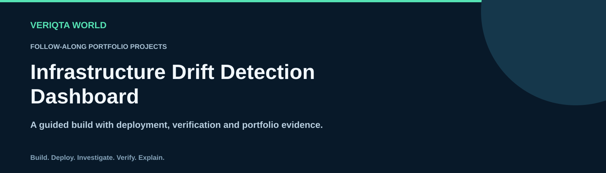
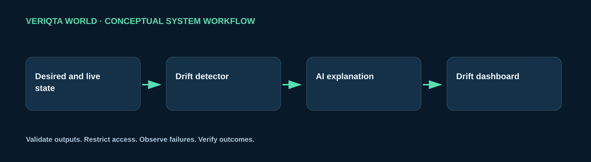

# Build a Infrastructure Drift Detection Dashboard

Build a service that detects infrastructure drift, records evidence and proposes reviewed corrective changes.

## What you will build

Create a working system with application components, an AI capability, automated delivery and operational visibility. Review access boundaries, test expected behaviour and investigate controlled failures.

## Architecture

This diagram shows the conceptual workflow. The implementation steps cover the application, infrastructure, delivery pipeline and operational controls.

## Follow the walkthrough

| Step | Build activity |
| --- | --- |
| 1 | [Understand the project](01-understand-the-project.md) |
| 2 | [Set up your environment](02-set-up-your-environment.md) |
| 3 | [Build the drift detection service](03-build-the-drift-detection-service.md) |
| 4 | [Add drift investigation](04-add-drift-investigation.md) |
| 5 | [Containerize the application](05-containerize-the-application.md) |
| 6 | [Create the infrastructure](06-create-the-infrastructure.md) |
| 7 | [Build the CI/CD pipeline](07-build-the-cicd-pipeline.md) |
| 8 | [Deploy and test the system](08-deploy-and-test-the-system.md) |
| 9 | [Add monitoring and security](09-add-monitoring-and-security.md) |
| 10 | [Break, fix and recover](10-break-fix-and-recover.md) |
| 11 | [Complete your own extension](11-complete-your-own-extension.md) |
| 12 | [Document your portfolio](12-document-your-portfolio.md) |
| 13 | [Clean up your resources](13-clean-up-your-resources.md) |

## Your final demonstration

Introduce unmanaged configuration, detect the difference and verify reconciliation.

## Portfolio evidence

Document the architecture, reproducible setup, deployment, test results and a failure investigation. Explain the AI component, how its output was checked and what happens when it is unavailable or incorrect. Include an independent extension and state which parts followed the guide.

## Supporting materials

- [Application code](app)
- [Infrastructure configuration](infrastructure)
- [Tests](tests)
- [Project visuals](assets)

[Return to the project catalogue](../../README.md#project-catalogue)
